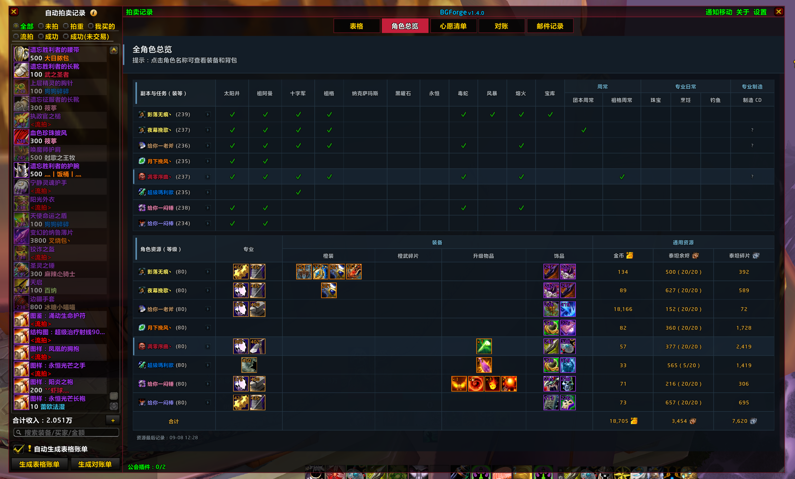
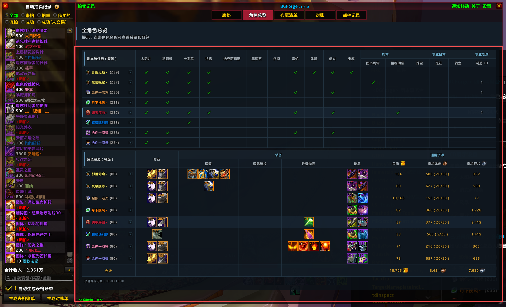
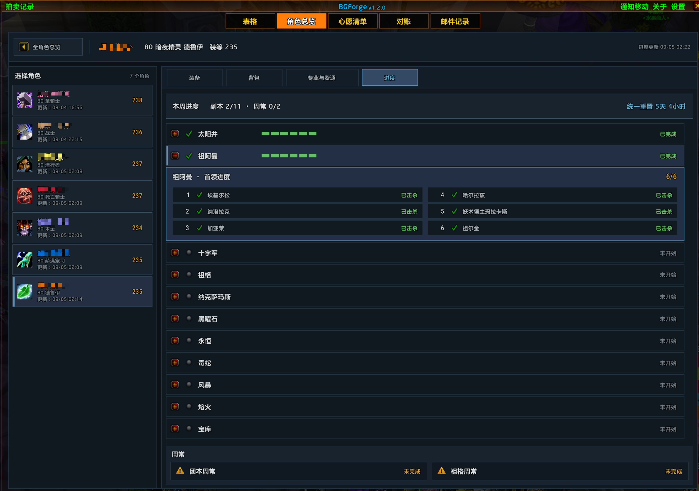
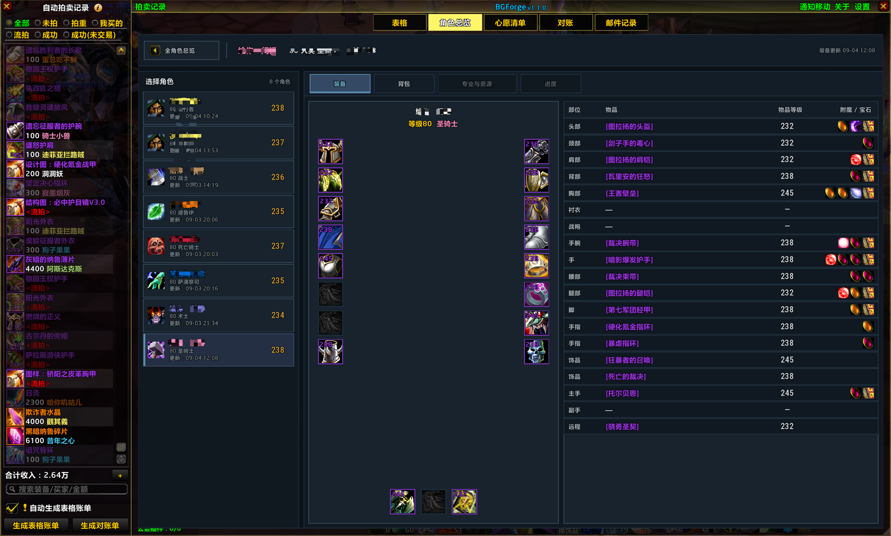
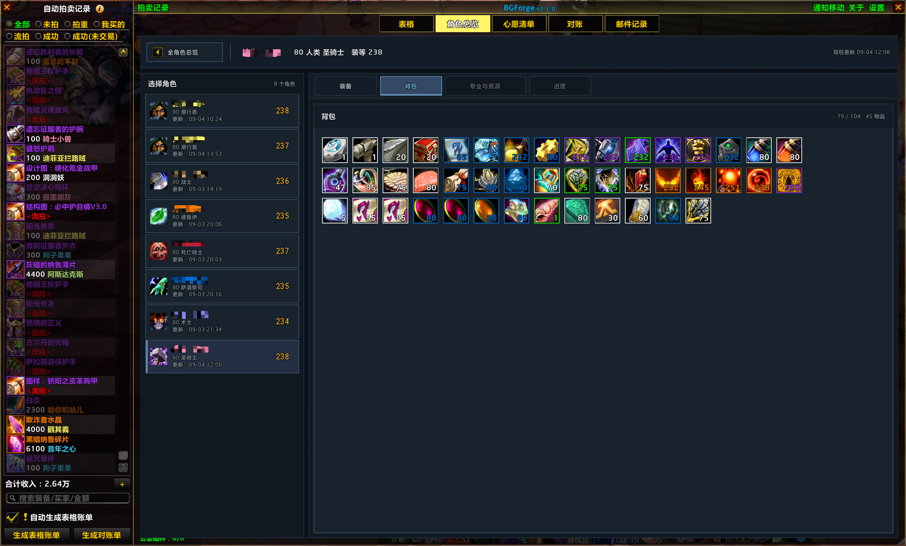

# 更新日志

本文件记录 BGForge 各版本的重要变更。

版本号遵循[语义化版本](https://semver.org/lang/zh-CN/)，日志格式参考
[Keep a Changelog](https://keepachangelog.com/zh-CN/1.1.0/)。

## v1.4.4 - 2026-09-10

### 修复

- 修复升级到 RurutiaSuite 3.7.3 后，聊天条“金”按钮再次无法打开 BGForge 的问题。

### 兼容性

- RurutiaSuite 兼容判断由仅匹配 3.7.2 改为支持 3.7.2 及以上版本，并按数字段比较版本号，确保 3.7.10 等版本也能正确识别。
- RurutiaSuite 3.7.1 及更早版本和无法解析的版本继续保留原点击行为。

### 隐私

- 本次兼容修复只在本地调整插件按钮点击路由，不收集、保存、同步或传输任何玩家数据。

## v1.4.3 - 2026-09-09

### 修复

- 修复 RurutiaSuite 3.7.2 更新后，聊天条“金”按钮因只检测 BGLite 和 BGNext 而无法打开 BGForge 的问题。

### 兼容性

- BGForge 现在仅在检测到受影响的 RurutiaSuite 3.7.2 时接管“金”按钮；RurutiaSuite 3.7.1 及更早版本、未知版本和未来版本继续保留原点击行为。
- BGForge 主界面切换统一使用稳定入口，原有 `/biaoge`、`/gbg`、`/bglite` 和 `/bgf` 命令行为保持不变。

### 隐私

- 本次兼容修复只在本地调整插件按钮点击路由，不收集、保存、同步或传输任何玩家数据。

## v1.4.2 - 2026-09-09

### 新增

- 团队领袖、队伍领袖和副本队伍领袖发送的 YY 号码现在会自动显示为可点击的聊天链接；支持 `YY`、`YY号`、`歪歪` 及号码在前的常见写法，并兼容号码中的空格。
- 加入团队后的前 10 分钟内，团长单独发送的 4 至 12 位纯数字也会自动识别为 YY 号码。

### 调整

- 点击 YY 链接会把号码放入聊天输入框；已有聊天草稿会保留，并在光标位置插入号码。
- YY 识别会跳过已有物品等聊天超链接，避免破坏原有链接内容。

### 隐私

- YY 链接功能只在本地处理当前可见的团长聊天消息，不保存 YY 号码、团长身份或团队名单，也不进行同步、广播或网络传输。

## v1.4.1 - 2026-09-08

### 新增

- 心愿清单的“首领掉落”区域新增装备名称与物品 ID 搜索；搜索结果继续使用双列物品区，并标明对应首领来源。
- 角色详情背包页改用统一搜索框，增加占位提示、清除按钮，以及 Enter/Escape 键盘操作。

### 调整

- 心愿清单三栏统一为稳定高度，“本阶段心愿”固定为 240 像素宽；首领目录、掉落列表与心愿汇总分别独立滚动，长列表不再撑高整个页面。
- “清空当前副本”移动到心愿汇总标题行并缩小为紧凑按钮；默认保持低调，仅在悬停和按下时显示危险色。
- 心愿清单的职业套装、首领和物品选中态统一改为更克制的底色与 2 像素 Rune Blue 标记；隐藏为零的首领心愿计数，并提高被装备过滤项的可读性。
- 装备过滤控件现在直接显示当前过滤方案名称；被过滤装备的透明度由 40% 调整为 60%。
- “背景材质透明度”现在同时控制角色总览与心愿清单的页头、角色详情模块和心愿清单各层结构背景；文字、图标、边框及状态色保持清晰。
- 角色总览大界面的角色名称及括号内装等/等级由 12 点调整为 14 点，专业和装备方块由 30×30 调整为 28×28；小界面保持原有字号和 22×22 方块。

### 修复

- 修复心愿清单异步加载职业套装资料后，后续标题可能沿用错误宽度、对齐或换行状态的问题。
- 修复选中底色可能覆盖物品品质边框，以及被过滤图标可能透出品质色而产生染色的问题。
- 修复在心愿清单中切换副本或框体尺寸后，内部列表可能保留过期滚动位置或出现多余外层滚动的问题。

### 隐私

- 本次更新只调整本地界面、过滤显示和布局状态，不新增玩家资料采集、同步、广播或网络传输。

### 界面预览

## v1.4.0 - 2026-09-08

### 新增

- 角色详情默认进入“今日”页，汇总当前角色的每日事项、未开始副本、周常、资源、专业与背包容量。
- 装备页增加经典纸娃娃布局、选中物品详情与 17 个功能装备位明细；背包增加名称搜索、分类筛选与滚动网格。

### 调整

- 角色详情采用统一角色列表、头像页头和“今日、装备、背包”三页导航；专业、资源、副本与周常进度统一汇总到“今日”页。
- 角色详情返回入口移回左上角；角色列表改为连续表格行，悬停时仅使用轻微背景高亮、不再强调边框；角色名称、等级信息与数据快照改为左侧三行垂直信息组。
- 左上返回区改为独立紧凑高度；左右 Header 与下方内容区共用单条分隔线，避免相邻边框叠成粗线。
- 右侧角色 Header 左缘增加 Rune Blue 竖向强调线，强化左右容器的视觉分隔。
- “今日”页左右两列改为连续面板，模块之间使用单条共享分隔线；周常采用紧凑的 Blizzard 任务图标。
- “今日”页所有副本统一使用状态图标、固定宽度 Boss 分段条和击杀数量；任意 Boss 已击杀即显示为“已完成”。
- “今日”页的团队副本优先展示已有进度，再展示未开始副本；本周有首领击杀即计为已完成，击杀数量独立保留，周常仍按任务记录判断。
- “今日”页的“专业日常”固定展示珠宝、烹饪和钓鱼三行；未学习或未达到等级/技能门槛的项目以弱化图标、灰色原因和不可交互状态呈现，并且不计入待完成数量。
- “今日”页不再显示不适用日常的页脚说明；周常与未开始团本统一使用紧凑的等待状态图标，三列标题统一垂直居中，专业名称恢复左对齐。
- 装备与背包快捷入口拆分为两个无边框的整块交互区域，悬停时使用设计系统底色和左侧 Rune Blue 焦点线反馈。
- “今日任务”概览下方的分隔线改为贯穿整列，更明确地区分下方独立的“专业日常”模块。
- “团队副本”的已有进度/尚未开始分组边界线与列标题分隔线统一宽度；“专业技能”和“专业日常”末行移除重复分隔线。
- 移除“资源与快捷入口”标题右侧含义模糊的更新时间，统一以角色头部的数据快照时间为准。
- “今日任务”概览移除片面的周常计数，并在“专业日常”“周常任务”标题右侧以标题同字号分别展示完成进度，明确待完成总数的组成。
- “资源与快捷入口”的泰坦余烬周进度贴近余烬数量并统一字号；未满周上限显示绿色，达到上限后显示红色。
- “团队副本”标题统计移除重复的周常进度，只保留副本完成数/总数。
- 移除独立的“专业与资源”和“进度”页签及旧跳转入口；相关底层快照与进度模型继续供“今日”页使用。
- 装备页改为连续深色面板：左右与底部装备槽组成经典纸娃娃，中部显示选中物品，右侧以紧凑明细列展示物品等级、附魔和宝石。
- 背包页统一采用连续面板、轻量分类页签和单线分组，保留搜索、筛选、物品提示及快捷交互。
- 数字文本改用当前游戏字体，不再随插件分发单独的 Roboto Condensed 字体文件。

### 修复

- 修复未学习烹饪或钓鱼的角色仍被提示对应日常“未完成”的问题；“今日”页会改为显示不适用及具体原因。
- 修复团队副本存在非连续 Boss 击杀时，进度条点亮方块可能多于实际击杀数量的问题。

### 隐私

- 新增的资格判断只在本机保存当前登录角色的烹饪、钓鱼技能等级与快照时间，不采集其他玩家资料，也不进行同步、广播或网络传输。

### 界面预览

## v1.3.0 - 2026-09-07

### 新增

- “角色总览”设置新增背景材质透明度滑块，并与“表格”中的同名设置双向同步；大小界面的背景、表头和角色行统一响应透明度变化。
- 检测到 BGLite 或原版 BiaoGe 同时启用时，冲突提示现在会列出全部冲突插件，并可在用户确认后暂时禁用它们并重载界面；也可选择暂不处理。

### 调整

- “角色总览”大小界面改为按实际字体、内容数量和可用视口自适应列宽、行高及图标尺寸；仅在空间确实不足时提供横向或纵向滚动，并为被截断的文字显示完整提示。
- 大界面的角色行增加整行悬停反馈和明确的详情入口；小界面也可点击角色名称，自动切换到大界面并打开对应角色详情。
- 大界面使用更宽松的行高和装备图标尺寸；小界面的泰坦余烬只显示总量，周获取进度继续保留在大界面。
- 角色总览与心愿清单统一使用更清晰的 72 像素页头、两级标题和短 Rune Blue 标记；角色总览的当前角色与完成状态改为更克制的底色和绿色勾选样式。
- 角色总览改为按金币、货币、专业、背包等事件分别更新对应数据，只在界面可见时请求重绘，并缓存已规范化的本地角色数据，减少重复扫描和无效渲染。

### 修复

- 修复小界面周重置时间可能被半透明顶栏遮挡的问题，并移除重复的手动刷新按钮，继续使用自动刷新。
- 修复角色详情中附魔与宝石提示可能沿用旧物品状态的问题。
- 修复角色详情左侧角色列表滚动时重复重建当前详情页的问题。

### 隐私

- 本次角色总览更新仍只读取和保存本机登录角色的既有快照，不新增其他玩家资料采集、同步、广播或网络传输。

## v1.2.0 - 2026-09-05

### 新增

- 角色详情“大界面”新增“专业与资源”页：集中展示珠宝、烹饪和钓鱼日常，两项主专业及其 Titan 长 CD，以及金币、泰坦余烬、泰坦碎片、橙武碎片和传说级升级材料。
- 专业制造状态区分可用、冷却中、尚未扫描和无长 CD，并在客户端提供有效时长时显示冷却进度。
- 角色详情“大界面”新增“进度”页，按固定顺序展示所选角色的 11 个 Titan 团本进度，以及团本周常、祖格周常。
- 团本行可展开按副本顺序排列的 Boss 明细，并明确标记已击杀与未击杀；全页共用一处重置倒计时。

### 调整

- 同步 BGLite 2.4.2 的自动清表保护：只有当前副本对应的 Boss 区域存在旧记录时才自动清空；当前区域为空时保留共享账本。
- 继续保留 BGForge 的共享阶段锁定保护，不通过团队成员名单推断是否换团，也不删除软关闭的本地历史表格源码。
- “角色总览”大界面与心愿清单统一使用紧凑页头，并调整内容宽度、留白和过滤控件位置。

### 修复

- 修复团本状态中文被数字字体显示为问号的问题；所有副本现在默认收起，即使尚未产生锁定记录也可展开查看首领顺序，并可再次点击已展开的副本将其收起。
- 团本列表的进度图标调整为灰色未开始、黄色进行中和绿色已完成三种明确状态。
- 修复全新或重置配置在主导航初始化时缺少透明度默认值的问题。

### 隐私

- “专业与资源”和“进度”页只读取既有本机角色快照，不新增玩家资料采集、同步、广播或传输行为。
- 自动清表继续只读取副本锁定、当前账本内容和本地副本映射，不新增团队成员身份数据依赖或网络传输。

### 界面预览

## v1.1.0 - 2026-09-04

### 新增

- “角色总览”大界面支持点击角色名称进入角色详情，并可在已记录角色之间直接切换。
- 角色详情新增装备与背包页：展示本机快照中的装备、物品等级、附魔、宝石、背包容量及物品堆叠数量。
- 装备与背包快照在物品资料完整后再整体更新，避免登录或换装过程中保存半套装备、空背包等临时状态。

### 调整

- 同步 BGLite 2.4.1：进本自动清空表格改为永久开启，并兼容覆盖旧版本中手动关闭的设置。
- 自动清表改为按共享结算阶段判断；同阶段任一关联副本已有锁定进度时保留整张表格，避免祖阿曼切换太阳井等连续活动丢失账目。
- 停止跨游戏会话保存拍卖聊天记录；当前会话中的拍卖聊天显示不受影响，既有存档数据不会主动删除。
- 解除新 CD 自动清表与历史备份的联动；历史功能继续保持软关闭，既有历史记录及旧自动保存来源仍可兼容读取。

### 修复

- 补充自动拍卖记录的空表和失效索引保护，避免生成对账、编辑或删除记录时触发 Lua 错误。

### 隐私

- 角色详情只读取并保存本机登录角色的装备和背包快照，不读取其他玩家单位，也不提供同步、广播或传输功能。
- 阶段清表只读取暴雪提供的副本锁定 ID 并使用本地副本映射，不新增团队名单、玩家身份、同步或传输数据。

### 界面预览

## v1.0.2 - 2026-09-03

### 新增

- 引入面向魔兽 Lua 原生控件的 BGForge design-system，统一界面颜色、文字层级、面板、按钮、选中态和悬停态。
- 主界面一级导航新增“角色总览”，无需依赖小地图插件集合，也可以在 BGForge 主框体内查看全角色信息；原有小地图悬停入口继续保留。

### 调整

- 将“表格、角色总览、心愿清单、对账、邮件记录”移动到主框体顶部，作为稳定可见的一级功能导航；通知移动、关于和设置集中到右上角工具区。
- 全角色总览改为主框体内的完整页面，并统一为深海军蓝、Rune Blue 与 Forge Gold 的视觉语言；列表默认使用同色背景，仅在选中和悬停时强调当前行。
- 右上角操作按钮提高默认可发现性，悬停时只改变按钮边框，不再改变内部图标颜色。
- 心愿清单按照 design-system 重新适配页头、职业套装、首领目录、掉落列表、本阶段心愿及危险操作样式，同时保留物品品质色和职业色作为内容信息。
- 心愿清单页头改为全宽布局，使用左侧 Rune Blue 标记，并由副本导航下划线承担唯一的横向分隔，避免重复边线。

### 修复

- 修复心愿清单原生高亮纹理放大透明度，导致悬停背景过亮的问题；选中状态下不再叠加悬停背景。
- 修复在不同高度的副本页面间切换后，心愿清单沿用旧内容高度和滚动位置、空列表仍出现滚动条的问题。

### 隐私

- 本次更新仅调整本地界面、导航和布局状态，不新增玩家资料收集、同步、广播或传输行为。

### 界面预览

## v1.0.1 - 2026-09-02

### 新增

- 全角色总览新增“专业制造”栏目，跟踪 Titan 当前仍有长 CD 的炼金研究、炼金转化、铭文研究、闪亮的玻璃、冰冻棱柱和冰川背包，并显示可用、冷却中或尚未观察到的状态。
- 角色资源表格新增“橙武碎片”栏目，统计角色背包与银行中的埃提耶什碎片数量，汇总所有角色进度，并在提示中显示 40 枚目标数量。

### 调整

- 暂时软下线 Titan 历史拍卖表格：隐藏保存、浏览和管理入口，停止新 CD 自动清表前的历史存档。
- 保留历史表格实现源码和既有存档数据，后续可根据官方规则重新启用。

### 隐私

- 专业制造状态与橙武碎片数量只保存在本机当前账号的角色总览记录中，不提供同步、广播或传输功能。

## v1.0.0 - 2026-08-31

### 新增

- 恢复 Titan 本地历史表格，可保存、浏览、重命名、删除并应用历史账本。
- 新增历史表格保留时长设置，可选择 30、90、180 天或永久保留；BGForge 历史记录同时限制最多保留 50 条。
- 新 CD 自动清空表格前默认保存本地历史；相同账本会自动去重，保存失败时保留当前表格并取消清空。
- 个人心愿单右上角新增装备过滤控件，与拍卖表格下方的过滤方案共享选择并双向同步。

### 调整

- 心愿单中的职业套装、首领掉落和本阶段心愿会使用当前装备过滤规则，不匹配的装备统一置灰。
- 新团队判断改为校验并去重当前及历史团队名单；当前团队名单暂不可用时不再误清空表格。
- 历史记录只持久化账本显示所需的装备、买家、金额、欠款和颜色字段；读取旧记录时也使用同一白名单。

### 隐私

- 本地历史表格不会保存、同步或传输团队名单、GUID、公会、交易日志、拍卖日志、团长资料或游戏版本字段。

## v0.4.0 - 2026-08-30

### 新增

- 自动拍卖设置重新提供“被过滤的装备自动折叠”；启用后，任一当前装备过滤方案命中的拍卖装备会自动折叠，关注、心愿和战网账号绑定装备保持展开。
- 新增 Titan 个人心愿单，可按副本与 BOSS 选择实际掉落；散件直接显示，套装等兑换装备只显示 Boss 掉落的兑换物。
- 心愿单界面按“本阶段心愿 / 职业套装 / 首领掉落”重新组织；同一套装兑换物跨首领去重，当前职业组默认展开，其他职业组默认折叠。
- 首领卡片优先显示已有头像资源，物品名称和左侧标识使用真实品质色；缺少头像时使用统一的首领占位图标。
- 心愿装备掉落时提供文字与语音提醒，且不依赖自动记账开关；拍卖时会标记为“心愿”并保持展开。
- 交易确认或额外奖励确认获得后自动移除对应心愿；普通掉落只提醒，不会提前删除。

### 调整

- 首领目录、首领掉落装备和本阶段心愿在内容溢出时使用各自的独立滚动区域，标题保持固定。
- 移除心愿单右上角的临时测试掉落与测试拍卖按钮。

### 隐私

- 心愿单仅在本机按当前角色保存副本、物品 ID 和 BOSS 位置，不收集团队成员资料，也不提供同步、广播或查询功能。

### 界面预览

## v0.3.0 - 2026-08-28

### 新增

- 全角色总览在“宝库”后新增“周常”和“专业日常”二级表头。
- “周常”分别展示团本周常和祖格周常；“专业日常”分别展示珠宝、烹饪和钓鱼完成状态。
- 已完成任务显示绿色勾，未完成保持空白，并按每日或每周重置周期独立清理。

### 调整

- 设置页使用“周常”和“专业日常”两个组级开关控制对应任务栏目。
- 角色资源表格会随总览窗口动态扩展，保持与上方副本和任务表格等宽。
- 原有单列周常完成记录会自动迁移到新的“团本周常”栏目。
- 缩短角色管理说明文案，明确删除总览人物不影响拍卖功能。
- 主界面顶部菜单调整为“通知移动、拍卖记录、全角色总览、关于、设置”。
- “说明书”入口改为“关于”，说明标题改为“关于 BGForge”，并移除说明中的 BGLite 版本号。

### 修复

- 修复全角色总览渲染函数超过 Titan Lua upvalue 上限，导致悬浮窗和团本 CD 设置无法加载的问题。

### 界面预览

## v0.2.0 - 2026-08-27

### 新增

- 回归 Titan 专精装备过滤，可按当前职业手动选择精简方案，并将不适合的装备置灰。
- 战网账号绑定装备始终保持高亮；过滤只解析本地物品提示，不调用战网接口。
- 装备过滤作用于当前表格、自动拍卖记录和正在拍卖的装备，不影响历史表格、拾取通知或装备库。
- 在底部方案图标前增加“装备过滤”标签，明确该区域用途。

### 调整

- 移除旧过滤后端及“被过滤的装备自动折叠”设置。
- 清理旧的按角色过滤存档，改为仅按职业保存当前方案。

### 界面预览

## v0.1.0 - 2026-08-26

### 新增

- 新增“全角色总览”，集中查看本机登录过的角色：
  - 本周团本锁定状态；
  - 角色等级与专业；
  - 橙装、升级物品及已装备饰品；
  - 金币、泰坦余烬和泰坦碎片。
- 支持从主界面入口、小地图星标悬浮窗，以及 `/bgr`、`/bgraid` 命令打开总览。
- 总览数据仅保存在本机 SavedVariables 中，不通过插件频道发送角色数据。

### 界面预览

