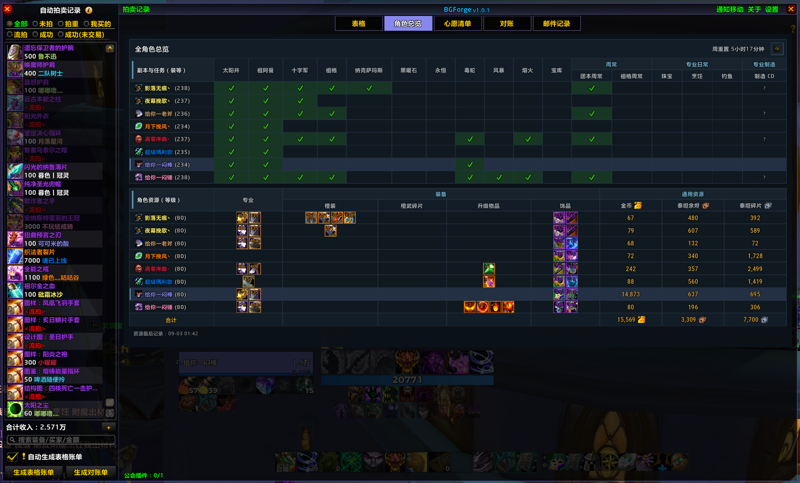
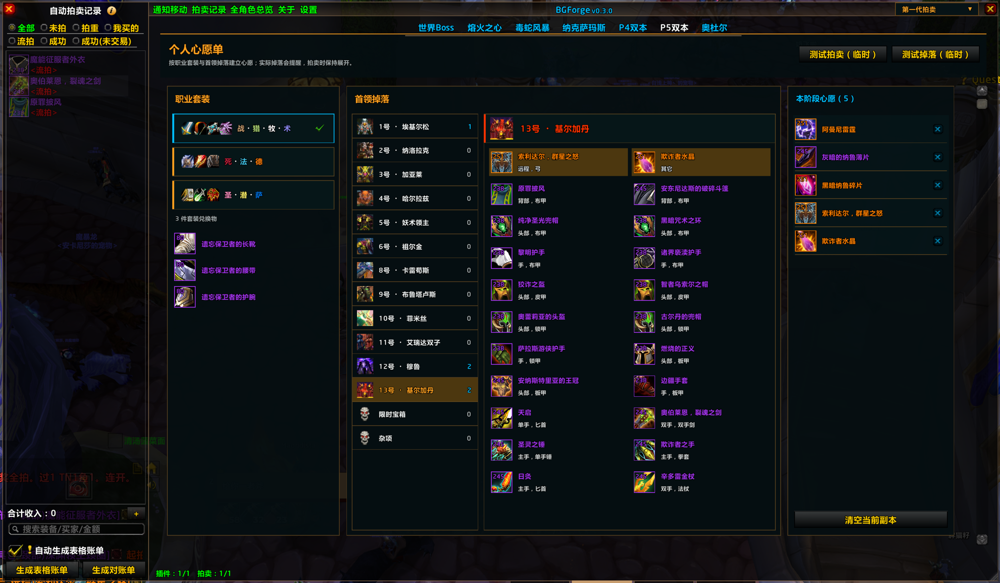
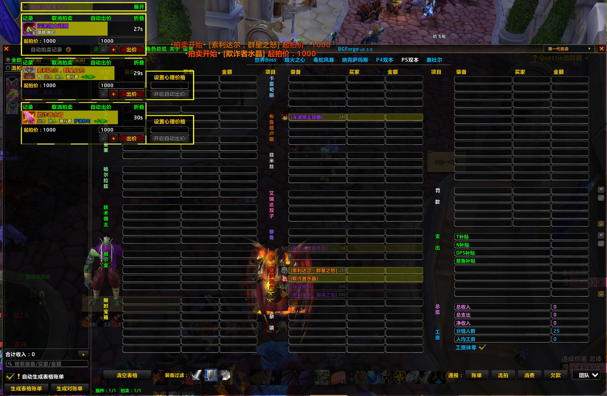

# 更新日志

本文件记录 BGForge 各版本的重要变更。

版本号遵循[语义化版本](https://semver.org/lang/zh-CN/)，日志格式参考
[Keep a Changelog](https://keepachangelog.com/zh-CN/1.1.0/)。

## v1.0.2 - 2026-09-03

### 新增

- 引入面向魔兽 Lua 原生控件的 BGForge design-system，统一界面颜色、文字层级、面板、按钮、选中态和悬停态。
- 主界面一级导航新增“角色总览”，无需依赖小地图插件集合，也可以在 BGForge 主框体内查看全角色信息；原有小地图悬停入口继续保留。

### 调整

- 将“表格、角色总览、心愿清单、对账、邮件记录”移动到主框体顶部，作为稳定可见的一级功能导航；通知移动、关于和设置集中到右上角工具区。
- 全角色总览改为主框体内的完整页面，并统一为深海军蓝、Rune Blue 与 Forge Gold 的视觉语言；列表默认使用同色背景，仅在选中和悬停时强调当前行。
- 右上角操作按钮提高默认可发现性，悬停时只改变按钮边框，不再改变内部图标颜色。
- 心愿清单按照 design-system 重新适配页头、职业套装、首领目录、掉落列表、本阶段心愿及危险操作样式，同时保留物品品质色和职业色作为内容信息。
- 心愿清单页头改为全宽布局，使用左侧 Rune Blue 标记，并由副本导航下划线承担唯一的横向分隔，避免重复边线。

### 修复

- 修复心愿清单原生高亮纹理放大透明度，导致悬停背景过亮的问题；选中状态下不再叠加悬停背景。
- 修复在不同高度的副本页面间切换后，心愿清单沿用旧内容高度和滚动位置、空列表仍出现滚动条的问题。

### 隐私

- 本次更新仅调整本地界面、导航和布局状态，不新增玩家资料收集、同步、广播或传输行为。

### 界面预览

## v1.0.1 - 2026-09-02

### 新增

- 全角色总览新增“专业制造”栏目，跟踪 Titan 当前仍有长 CD 的炼金研究、炼金转化、铭文研究、闪亮的玻璃、冰冻棱柱和冰川背包，并显示可用、冷却中或尚未观察到的状态。
- 角色资源表格新增“橙武碎片”栏目，统计角色背包与银行中的埃提耶什碎片数量，汇总所有角色进度，并在提示中显示 40 枚目标数量。

### 调整

- 暂时软下线 Titan 历史拍卖表格：隐藏保存、浏览和管理入口，停止新 CD 自动清表前的历史存档。
- 保留历史表格实现源码和既有存档数据，后续可根据官方规则重新启用。

### 隐私

- 专业制造状态与橙武碎片数量只保存在本机当前账号的角色总览记录中，不提供同步、广播或传输功能。

## v1.0.0 - 2026-08-31

### 新增

- 恢复 Titan 本地历史表格，可保存、浏览、重命名、删除并应用历史账本。
- 新增历史表格保留时长设置，可选择 30、90、180 天或永久保留；BGForge 历史记录同时限制最多保留 50 条。
- 新 CD 自动清空表格前默认保存本地历史；相同账本会自动去重，保存失败时保留当前表格并取消清空。
- 个人心愿单右上角新增装备过滤控件，与拍卖表格下方的过滤方案共享选择并双向同步。

### 调整

- 心愿单中的职业套装、首领掉落和本阶段心愿会使用当前装备过滤规则，不匹配的装备统一置灰。
- 新团队判断改为校验并去重当前及历史团队名单；当前团队名单暂不可用时不再误清空表格。
- 历史记录只持久化账本显示所需的装备、买家、金额、欠款和颜色字段；读取旧记录时也使用同一白名单。

### 隐私

- 本地历史表格不会保存、同步或传输团队名单、GUID、公会、交易日志、拍卖日志、团长资料或游戏版本字段。

## v0.4.0 - 2026-08-30

### 新增

- 自动拍卖设置重新提供“被过滤的装备自动折叠”；启用后，任一当前装备过滤方案命中的拍卖装备会自动折叠，关注、心愿和战网账号绑定装备保持展开。
- 新增 Titan 个人心愿单，可按副本与 BOSS 选择实际掉落；散件直接显示，套装等兑换装备只显示 Boss 掉落的兑换物。
- 心愿单界面按“本阶段心愿 / 职业套装 / 首领掉落”重新组织；同一套装兑换物跨首领去重，当前职业组默认展开，其他职业组默认折叠。
- 首领卡片优先显示已有头像资源，物品名称和左侧标识使用真实品质色；缺少头像时使用统一的首领占位图标。
- 心愿装备掉落时提供文字与语音提醒，且不依赖自动记账开关；拍卖时会标记为“心愿”并保持展开。
- 交易确认或额外奖励确认获得后自动移除对应心愿；普通掉落只提醒，不会提前删除。

### 调整

- 首领目录、首领掉落装备和本阶段心愿在内容溢出时使用各自的独立滚动区域，标题保持固定。
- 移除心愿单右上角的临时测试掉落与测试拍卖按钮。

### 隐私

- 心愿单仅在本机按当前角色保存副本、物品 ID 和 BOSS 位置，不收集团队成员资料，也不提供同步、广播或查询功能。

### 界面预览

## v0.3.0 - 2026-08-28

### 新增

- 全角色总览在“宝库”后新增“周常”和“专业日常”二级表头。
- “周常”分别展示团本周常和祖格周常；“专业日常”分别展示珠宝、烹饪和钓鱼完成状态。
- 已完成任务显示绿色勾，未完成保持空白，并按每日或每周重置周期独立清理。

### 调整

- 设置页使用“周常”和“专业日常”两个组级开关控制对应任务栏目。
- 角色资源表格会随总览窗口动态扩展，保持与上方副本和任务表格等宽。
- 原有单列周常完成记录会自动迁移到新的“团本周常”栏目。
- 缩短角色管理说明文案，明确删除总览人物不影响拍卖功能。
- 主界面顶部菜单调整为“通知移动、拍卖记录、全角色总览、关于、设置”。
- “说明书”入口改为“关于”，说明标题改为“关于 BGForge”，并移除说明中的 BGLite 版本号。

### 修复

- 修复全角色总览渲染函数超过 Titan Lua upvalue 上限，导致悬浮窗和团本 CD 设置无法加载的问题。

### 界面预览

## v0.2.0 - 2026-08-27

### 新增

- 回归 Titan 专精装备过滤，可按当前职业手动选择精简方案，并将不适合的装备置灰。
- 战网账号绑定装备始终保持高亮；过滤只解析本地物品提示，不调用战网接口。
- 装备过滤作用于当前表格、自动拍卖记录和正在拍卖的装备，不影响历史表格、拾取通知或装备库。
- 在底部方案图标前增加“装备过滤”标签，明确该区域用途。

### 调整

- 移除旧过滤后端及“被过滤的装备自动折叠”设置。
- 清理旧的按角色过滤存档，改为仅按职业保存当前方案。

### 界面预览

## v0.1.0 - 2026-08-26

### 新增

- 新增“全角色总览”，集中查看本机登录过的角色：
  - 本周团本锁定状态；
  - 角色等级与专业；
  - 橙装、升级物品及已装备饰品；
  - 金币、泰坦余烬和泰坦碎片。
- 支持从主界面入口、小地图星标悬浮窗，以及 `/bgr`、`/bgraid` 命令打开总览。
- 总览数据仅保存在本机 SavedVariables 中，不通过插件频道发送角色数据。

### 界面预览

