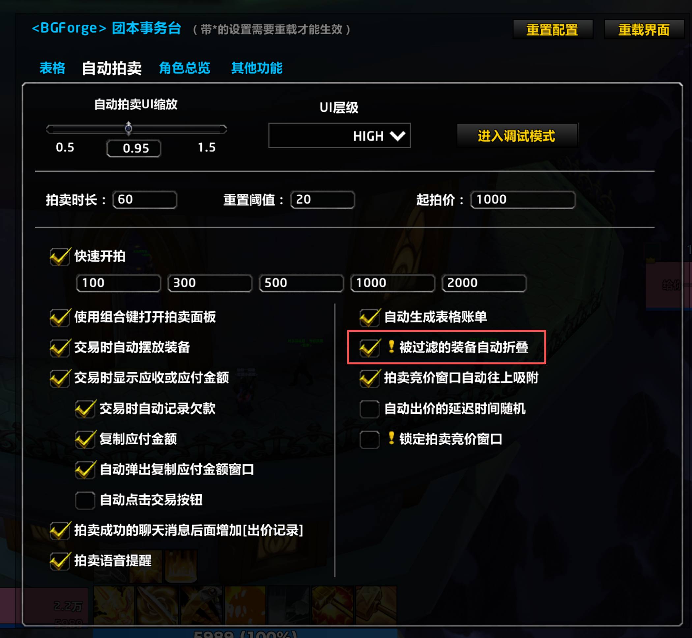
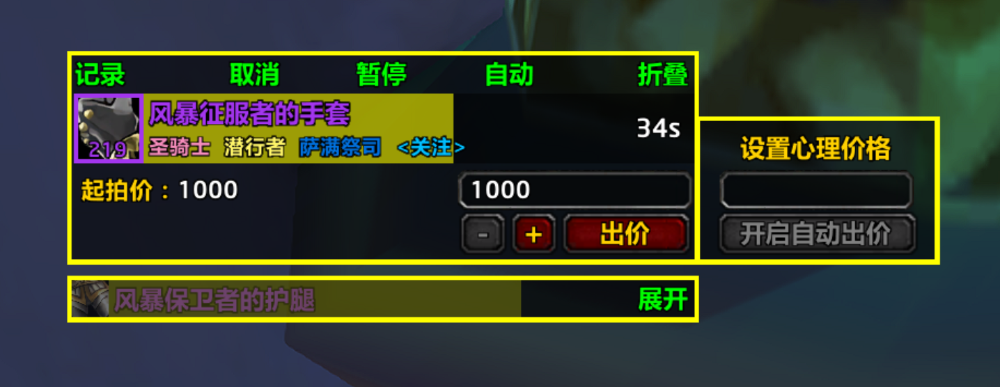
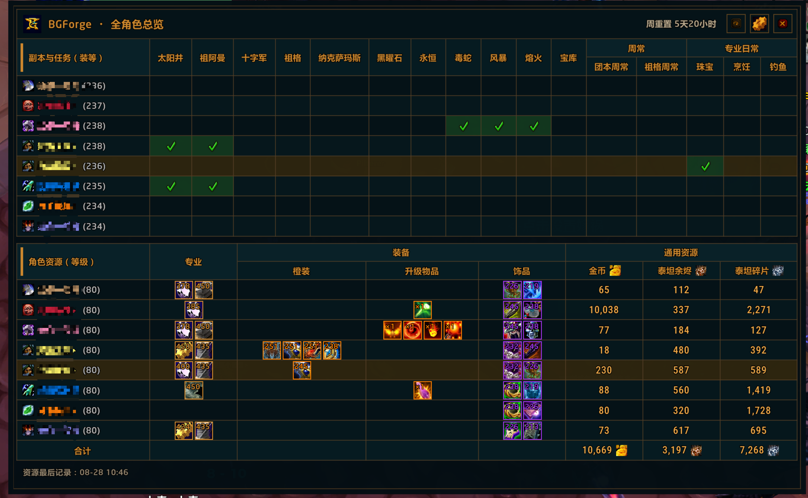
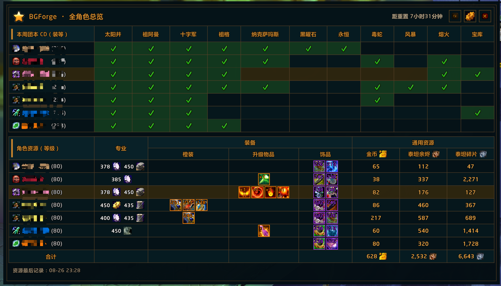

# 更新日志

本文件记录 BGForge 各版本的重要变更。

版本号遵循[语义化版本](https://semver.org/lang/zh-CN/)，日志格式参考
[Keep a Changelog](https://keepachangelog.com/zh-CN/1.1.0/)。

## 未发布

### 新增

- 自动拍卖设置重新提供“被过滤的装备自动折叠”；启用后，任一当前装备过滤方案命中的拍卖装备会自动折叠，关注、心愿和战网账号绑定装备保持展开。

### 界面预览

## v0.3.0 - 2026-08-28

### 新增

- 全角色总览在“宝库”后新增“周常”和“专业日常”二级表头。
- “周常”分别展示团本周常和祖格周常；“专业日常”分别展示珠宝、烹饪和钓鱼完成状态。
- 已完成任务显示绿色勾，未完成保持空白，并按每日或每周重置周期独立清理。

### 调整

- 设置页使用“周常”和“专业日常”两个组级开关控制对应任务栏目。
- 角色资源表格会随总览窗口动态扩展，保持与上方副本和任务表格等宽。
- 原有单列周常完成记录会自动迁移到新的“团本周常”栏目。
- 缩短角色管理说明文案，明确删除总览人物不影响拍卖功能。
- 主界面顶部菜单调整为“通知移动、拍卖记录、全角色总览、关于、设置”。
- “说明书”入口改为“关于”，说明标题改为“关于 BGForge”，并移除说明中的 BGLite 版本号。

### 修复

- 修复全角色总览渲染函数超过 Titan Lua upvalue 上限，导致悬浮窗和团本 CD 设置无法加载的问题。

### 界面预览

## v0.2.0 - 2026-08-27

### 新增

- 回归 Titan 专精装备过滤，可按当前职业手动选择精简方案，并将不适合的装备置灰。
- 战网账号绑定装备始终保持高亮；过滤只解析本地物品提示，不调用战网接口。
- 装备过滤作用于当前表格、自动拍卖记录和正在拍卖的装备，不影响历史表格、拾取通知或装备库。
- 在底部方案图标前增加“装备过滤”标签，明确该区域用途。

### 调整

- 移除旧过滤后端及“被过滤的装备自动折叠”设置。
- 清理旧的按角色过滤存档，改为仅按职业保存当前方案。

### 界面预览

## v0.1.0 - 2026-08-26

### 新增

- 新增“全角色总览”，集中查看本机登录过的角色：
  - 本周团本锁定状态；
  - 角色等级与专业；
  - 橙装、升级物品及已装备饰品；
  - 金币、泰坦余烬和泰坦碎片。
- 支持从主界面入口、小地图星标悬浮窗，以及 `/bgr`、`/bgraid` 命令打开总览。
- 总览数据仅保存在本机 SavedVariables 中，不通过插件频道发送角色数据。

### 界面预览

